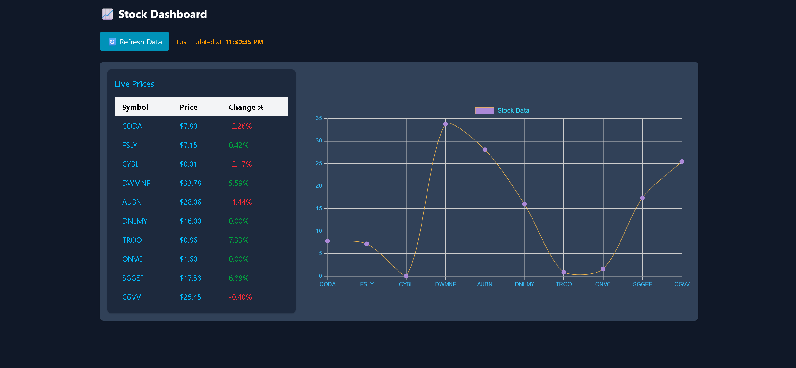

# 📈 Stock Dashboard

A real-time stock market monitoring application built with React, TypeScript, and Finnhub API. **[Live Demo](https://stockpricedashboard-o2wzlc7oc-amadabhs-projects.vercel.app/)**



## ✨ Features

- **Live Stock Data**: Fetches real-time quotes for US stocks
- **Interactive Chart**: Visualizes price trends with Chart.js
- **Smart Caching**: 
  - 10-minute client-side cache to reduce API calls
  - Timestamp tracking for last update
- **Responsive UI**: Dark-themed interface with Tailwind CSS
- **Rate Limiting**: 15-second refresh cooldown to prevent API abuse

## 🛠 Tech Stack

**Frontend**  
- React + TypeScript
- Tailwind CSS
- Chart.js

**Backend**  
- Node.js/Express
- Finnhub API
- Axios for HTTP requests

**Infrastructure**  
- Vercel (Frontend + Serverless Functions)

## 🚀 Live Demo

➡️ **[https://stockpricedashboard-o2wzlc7oc-amadabhs-projects.vercel.app/](https://stockpricedashboard-o2wzlc7oc-amadabhs-projects.vercel.app/)**

## 🛠 Local Setup

1. Clone the repo:
   ```bash
   git clone https://github.com/your-username/stock-dashboard.git
